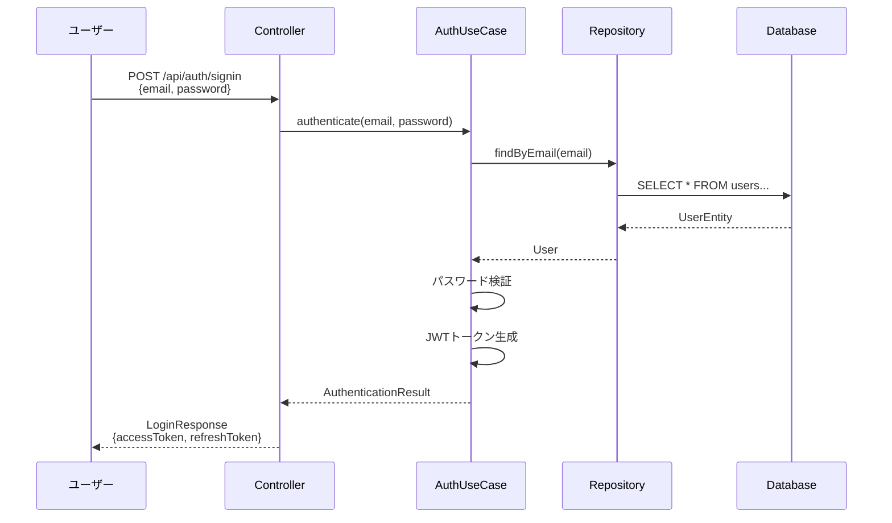

# J15 Backend - 初学者向け開発ガイド

## 📚 目次

1. [プロジェクト概要](#1-プロジェクト概要)
2. [技術スタック解説](#2-技術スタック解説)
3. [オニオンアーキテクチャ入門](#3-オニオンアーキテクチャ入門)
4. [主要機能の仕組み](#4-主要機能の仕組み)
5. [開発環境セットアップ](#5-開発環境セットアップ)
6. [コード例とベストプラクティス](#6-コード例とベストプラクティス)
7. [よくある質問 (FAQ)](#7-よくある質問-faq)
8. [次のステップ](#8-次のステップ)

---

## 1. プロジェクト概要

### このプロジェクトは何をするもの？

**J15 Backend**は、学習管理システムのバックエンドAPIです。以下の機能を提供します：

- 📖 **題材管理**: 学習コンテンツの登録・管理
- 📝 **セクション管理**: 各題材のチャプター管理
- 📊 **進捗管理**: ユーザーの学習進捗を記録
- 🔐 **認証機能**: ユーザー登録・ログイン
- 🖼️ **画像管理**: セクションに関連する画像のアップロード

### 誰が使うの？

1. **一般ユーザー**: 学習コンテンツの閲覧、進捗記録
2. **管理者**: コンテンツの作成・編集・削除

---

## 2. 技術スタック解説

### 2.1 Kotlin って何？

**Kotlin**は、Javaの後継として開発されたプログラミング言語です。

**特徴**:
- ✅ **簡潔**: Javaより少ないコードで同じことができる
- ✅ **安全**: Null安全性でバグを減らせる
- ✅ **Java互換**: Javaのライブラリがそのまま使える

**例: Javaとの比較**
```kotlin
// Kotlin (シンプル！)
data class User(val name: String, val age: Int)

// Java (冗長...)
public class User {
    private final String name;
    private final int age;

    public User(String name, int age) {
        this.name = name;
        this.age = age;
    }

    public String getName() { return name; }
    public int getAge() { return age; }
    // equals, hashCode, toString も必要...
}
```

### 2.2 Spring Boot って何？

**Spring Boot**は、Webアプリケーションを簡単に作るためのフレームワークです。

**何ができる？**:
- 🌐 **Web API作成**: RESTful APIを簡単に実装
- 💾 **データベース連携**: SQLを書かなくてもDB操作できる
- 🔒 **セキュリティ**: 認証・認可の仕組みが組み込み済み

**例: APIエンドポイントの作成**
```kotlin
@RestController
@RequestMapping("/api/health")
class HealthCheckController {

    @GetMapping
    fun health(): Map<String, String> {
        return mapOf("status" to "OK")
    }
}
```
これだけで `GET /api/health` というAPIができます！

### 2.3 PostgreSQL って何？

**PostgreSQL**は、リレーショナルデータベース（RDB）の一種です。

**データの保存方法**:
```
ユーザーテーブル
┌─────────┬──────────┬────────────────┐
│ user_id │ username │ email          │
├─────────┼──────────┼────────────────┤
│ 001     │ tanaka   │ tanaka@ex.com  │
│ 002     │ suzuki   │ suzuki@ex.com  │
└─────────┴──────────┴────────────────┘
```

---

## 3. オニオンアーキテクチャ入門

### 3.1 オニオンアーキテクチャとは？

コードを**玉ねぎの層**のように分けて整理する設計方法です。

```
        ┌─────────────────────────────┐
        │   Presentation (外側)       │  ← API エンドポイント
        │  ┌─────────────────────┐    │
        │  │ Infrastructure      │    │  ← データベース、外部API
        │  │  ┌─────────────┐    │    │
        │  │  │ Application │    │    │  ← ビジネスロジック
        │  │  │  ┌───────┐  │    │    │
        │  │  │  │ Domain│  │    │    │  ← 中心: ビジネスルール
        │  │  │  └───────┘  │    │    │
        │  │  └─────────────┘    │    │
        │  └─────────────────────┘    │
        └─────────────────────────────┘
```

### 3.2 各層の役割

#### 🎯 Domain層 (中心)
**役割**: ビジネスのルールを定義
**例**: 「ユーザーのメールアドレスは重複禁止」

```kotlin
// src/main/kotlin/com/j15/backend/domain/model/user/User.kt
data class User(
    val userId: UserId,
    val username: Username,
    val email: Email,  // ← Email型で安全性を保証
    val passwordHash: PasswordHash,
    val role: UserRole = UserRole.ROLE_USER
)
```

#### ⚙️ Application層
**役割**: ビジネスロジックの実装
**例**: 「ユーザー登録時の重複チェック」

```kotlin
// src/main/kotlin/com/j15/backend/application/usecase/auth/AuthUseCase.kt
fun authenticate(email: String, plainPassword: String): AuthenticationResult {
    val user = userRepository.findByEmail(Email(email))
    // パスワード検証、トークン生成...
}
```

#### 🗄️ Infrastructure層
**役割**: 外部とのやり取り（DB、AWS S3など）
**例**: 「データベースへの保存処理」

```kotlin
// src/main/kotlin/com/j15/backend/infrastructure/persistence/repository/UserRepositoryImpl.kt
@Repository
class UserRepositoryImpl(
    private val jpaRepository: JpaUserRepository
) : UserRepository {
    override fun save(user: User): User {
        val entity = UserConverter.toEntity(user)
        val saved = jpaRepository.save(entity)
        return UserConverter.toDomain(saved)
    }
}
```

#### 🌐 Presentation層
**役割**: APIエンドポイントの定義
**例**: 「POST /api/auth/signin」

```kotlin
// src/main/kotlin/com/j15/backend/presentation/controller/auth/AuthController.kt
@PostMapping("/signin")
fun signIn(@RequestBody request: LoginRequest): ResponseEntity<LoginResponse> {
    val result = authUseCase.authenticate(request.email, request.password)
    return ResponseEntity.ok(LoginResponse(result.tokens))
}
```

### 3.3 なぜこの構造？

**メリット**:
1. ✅ **変更に強い**: データベースを変えても、Domain層は変更不要
2. ✅ **テストしやすい**: 各層を独立してテストできる
3. ✅ **理解しやすい**: 責任が明確に分かれている

---

## 4. 主要機能の仕組み

### 4.1 ユーザー認証フロー



**ステップ解説**:
1. **ユーザー**: メールアドレスとパスワードを送信
2. **Controller**: リクエストを受け取り、UseCaseに委譲
3. **UseCase**:
   - メールアドレスでユーザー検索
   - パスワード検証（BCrypt）
   - JWTトークン生成
4. **Repository**: データベースからユーザー情報取得
5. **Response**: アクセストークンとリフレッシュトークンを返却

### 4.2 進捗管理フロー

**シナリオ**: ユーザーがセクション1を完了マーク

```kotlin
// 1. ユーザーからのリクエスト
POST /api/progress/subjects/1/sections
{
  "sectionId": 1
}

// 2. UseCaseでの処理
fun markSectionAsCleared(
    userId: UserId,
    subjectId: SubjectId,
    sectionId: SectionId
): UserClearedSection {
    // ① 題材とセクションの存在確認
    val subject = subjectRepository.findById(subjectId)
        ?: throw IllegalArgumentException("題材が見つかりません")

    sectionRepository.findById(subjectId, sectionId)
        ?: throw IllegalArgumentException("セクションが見つかりません")

    // ② 進捗情報の作成
    val userProgress = getUserProgress(userId, subjectId)
    val cleared = userProgress.markSectionAsCleared(sectionId)

    // ③ データベースに保存
    return clearedSectionRepository.save(cleared)
}

// 3. データベースへの保存
INSERT INTO user_cleared_sections
    (user_id, subject_id, section_id, completed_at)
VALUES
    ('uuid', 1, 1, '2025-12-21 10:00:00');
```

### 4.3 JWT認証の仕組み

**JWT (JSON Web Token)**: サーバーレスでユーザー認証を行う仕組み

```
┌─────────────────────────────────────────────────┐
│ JWT Token の構造                                 │
├─────────────────────────────────────────────────┤
│ Header    │ Payload         │ Signature         │
│ (暗号化方式) │ (ユーザー情報)    │ (改ざん防止)       │
├─────────────────────────────────────────────────┤
│ {"alg":   │ {"userId":      │ HMACSHA256(       │
│  "HS256"} │  "abc-123",     │   base64(header)  │
│           │  "role":        │   + "." +         │
│           │  "ROLE_USER"}   │   base64(payload),│
│           │                 │   secret)         │
└─────────────────────────────────────────────────┘
```

**認証フィルターの動作**:
```kotlin
// src/main/kotlin/com/j15/backend/infrastructure/security/JwtAuthenticationFilter.kt
override fun doFilterInternal(request, response, filterChain) {
    try {
        // ① Authorizationヘッダーからトークン抽出
        val token = extractTokenFromRequest(request)

        // ② トークンの検証
        if (token != null && jwtTokenService.validateToken(token)) {
            // ③ トークンからユーザー情報を取得
            val userId = jwtTokenService.getUserIdFromToken(token)
            val role = jwtTokenService.getRoleFromToken(token)

            // ④ Spring SecurityのContextに認証情報を設定
            val authentication = UsernamePasswordAuthenticationToken(
                userId, null, listOf(SimpleGrantedAuthority(role.name))
            )
            SecurityContextHolder.getContext().authentication = authentication
        }
    } catch (e: Exception) {
        // エラーログ出力、Contextは空のまま
    }

    // ⑤ 次のフィルターへ
    filterChain.doFilter(request, response)
}
```

---

## 5. 開発環境セットアップ

### 5.1 必要なツール

| ツール | バージョン | 用途 |
|--------|-----------|------|
| Java | 17以上 | Kotlinの実行環境 |
| Docker | 最新版 | PostgreSQL起動 |
| Git | 最新版 | バージョン管理 |

### 5.2 セットアップ手順

#### ステップ1: リポジトリのクローン
```bash
git clone https://github.com/J15team/Backend.git
cd backend
```

#### ステップ2: Docker Composeで起動
```bash
# PostgreSQLとアプリケーションを起動
docker-compose up -d

# ログ確認
docker-compose logs -f
```

#### ステップ3: 動作確認
```bash
# ヘルスチェック
curl http://localhost:8080/api/health

# 期待されるレスポンス
{"status":"OK"}
```

### 5.3 ローカル開発の流れ

```bash
# 1. コード変更後、ビルド確認
./gradlew build

# 2. Docker環境で動作テスト
docker-compose up -d

# 3. APIテスト
curl -X POST http://localhost:8080/api/auth/signup \
  -H "Content-Type: application/json" \
  -d '{
    "username": "testuser",
    "email": "test@example.com",
    "password": "password123"
  }'
```

---

## 6. コード例とベストプラクティス

### 6.1 値オブジェクトパターン

**なぜ使う？**: 型安全性を高め、バグを防ぐ

**悪い例**:
```kotlin
// ❌ String型で混乱の元
fun createUser(userId: String, username: String, email: String)

// どれがどれ？間違えやすい！
createUser("tanaka", "123e4567", "tanaka@example.com")
```

**良い例**:
```kotlin
// ✅ 型で区別できる
data class UserId(val value: UUID)
data class Username(val value: String)
data class Email(val value: String)

fun createUser(userId: UserId, username: Username, email: Email)

// コンパイラがチェックしてくれる
createUser(
    UserId(UUID.randomUUID()),
    Username("tanaka"),
    Email("tanaka@example.com")
)
```

### 6.2 エラーハンドリング

**ビジネスロジックエラー**:
```kotlin
// UseCase層でバリデーション
fun updateSubject(subjectId: Long, title: String, maxSections: Int): Subject {
    // ① 入力値検証
    require(maxSections in 1..1000) {
        "最大セクション数は1以上1000以下である必要があります"
    }

    // ② 存在確認
    val existing = subjectRepository.findById(SubjectId(subjectId))
        ?: throw IllegalArgumentException("題材が見つかりません: $subjectId")

    // ③ 更新処理
    return subjectRepository.save(existing.copy(title = title))
}
```

**グローバルエラーハンドラー**:
```kotlin
@RestControllerAdvice
class GlobalExceptionHandler {

    @ExceptionHandler(IllegalArgumentException::class)
    fun handleIllegalArgumentException(ex: IllegalArgumentException): ResponseEntity<ErrorResponse> {
        return ResponseEntity.status(HttpStatus.BAD_REQUEST)
            .body(ErrorResponse(
                message = ex.message ?: "不正なリクエストです",
                status = 400
            ))
    }
}
```

### 6.3 トランザクション管理

**読み取り専用トランザクション**:
```kotlin
@Transactional(readOnly = true)  // ← パフォーマンス向上
fun getAllSubjects(): List<Subject> {
    return subjectRepository.findAll()
}
```

**書き込みトランザクション**:
```kotlin
@Transactional  // ← 自動ロールバック
fun createSubject(subjectId: Long, title: String): Subject {
    val subject = Subject(SubjectId(subjectId), title)
    return subjectRepository.save(subject)
    // 例外発生時は自動的にロールバック
}
```

### 6.4 セキュリティのベストプラクティス

#### パスワードのハッシュ化
```kotlin
// ❌ 絶対にやってはいけない
val password = "password123"  // 平文で保存

// ✅ BCryptでハッシュ化
val passwordEncoder = BCryptPasswordEncoder()
val hashedPassword = passwordEncoder.encode("password123")
// → "$2a$10$N9qo8uLOickgx2ZMRZoMye..."
```

#### タイミング攻撃の防止
```kotlin
// ユーザーが存在しない場合でも処理時間を一定に保つ
fun authenticate(email: String, plainPassword: String): AuthenticationResult {
    val user = userRepository.findByEmail(Email(email))

    val targetHash = user?.passwordHash?.value ?: dummyHash

    // ユーザーの存在に関わらず、必ずハッシュ検証を実行
    val isValid = passwordHashService.matches(plainPassword, targetHash)

    if (user == null || !isValid) {
        throw SecurityException("認証に失敗しました")
    }

    return AuthenticationResult(user, generateTokens(user))
}
```

---

## 7. よくある質問 (FAQ)

### Q1: オニオンアーキテクチャのメリットは？
**A**:
- ビジネスロジック（Domain層）が外部技術に依存しない
- データベースやフレームワークを変更しても中心部は変更不要
- 層ごとに独立してテストできる

### Q2: data class って何が便利なの？
**A**:
```kotlin
data class User(val name: String, val age: Int)

// 自動的に以下が生成される
// - equals() / hashCode()
// - toString()
// - copy() メソッド
val user1 = User("tanaka", 25)
val user2 = user1.copy(age = 26)  // 一部だけ変更
```

### Q3: JWT認証はどこで使われてる？
**A**:
- `/api/progress/**` → 認証必須
- `/api/subjects` (GET) → 認証不要
- `/api/subjects` (POST/PUT/DELETE) → 管理者権限必須

### Q4: レート制限って何？
**A**:
同一IPアドレスから大量のリクエストが来るのを防ぐ仕組み。
- 制限: 60秒あたり100リクエスト
- 超過時: HTTP 429エラーを返す

---

## 8. 次のステップ

### 初心者向けタスク
1. ✅ Docker環境で動作確認
2. ✅ ヘルスチェックAPIの実装を読む
3. ✅ 題材一覧取得APIの動作を確認
4. 🔄 シンプルなAPIエンドポイントを追加してみる

### 中級者向けタスク
1. ユニットテストの追加
2. 新しいユースケースの実装
3. パフォーマンス改善（N+1問題の解消）

### 参考リソース
- [Kotlin公式ドキュメント](https://kotlinlang.org/docs/home.html)
- [Spring Boot公式ガイド](https://spring.io/guides)
- [オニオンアーキテクチャ解説](https://jeffreypalermo.com/2008/07/the-onion-architecture-part-1/)

---

**最終更新日**: 2025-12-21
